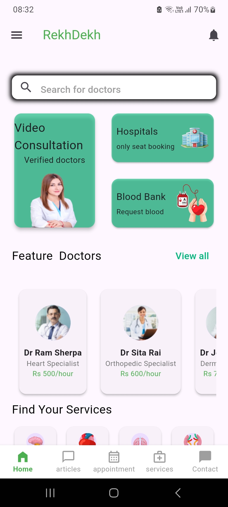
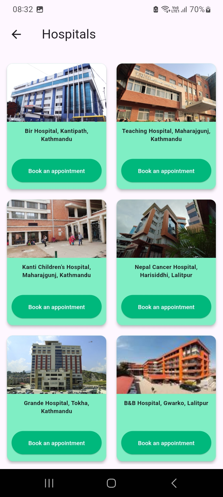
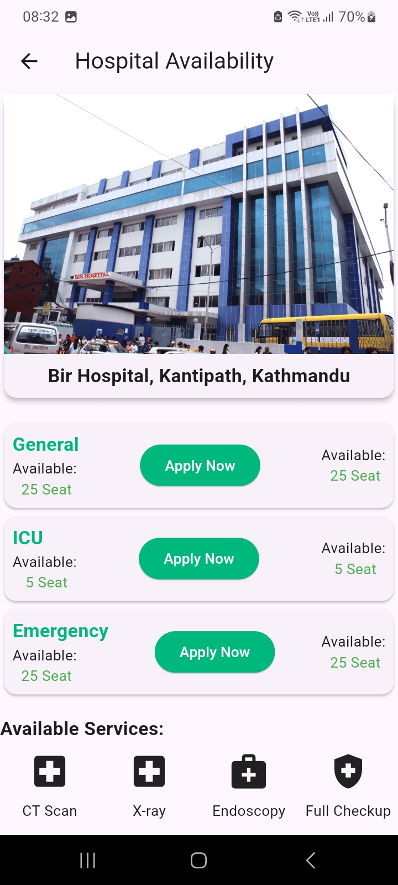
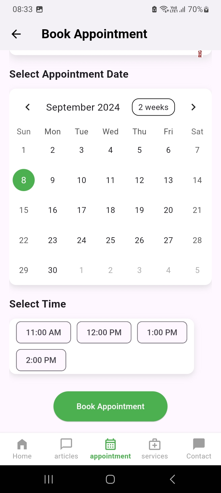

# RekhDekh
## Project for AsianHack2024

### Overview
RekhDekh is a healthcare app designed to bridge the gap between doctors and patients. It provides various information about medical institutions and simplifies access to medical consultations, hospital bookings, and lab tests. 
<!-- It allows consultation with professionals remotely, book hospital appointments, and request blood easily. -->

### Features

- Learn about nearby hospitals and the real-time availability of services in them.

 
 

- Schedule appointments in hospitals or with specific doctors online.

### Instructions to run
For the main app,
1. Make sure flutter is installed on the system.
2. Open a terminal in the [flutter](flutter/) directory.
3. run `flutter pub get`
4. run flutter app

For the additional features in python (blog, webcam)
Note: These have not been integrated into the frontend
1. Make sure python is installed on the system.
2. Open a terminal in the [python](python/) directory.
3. create a virtual environment and install dependencies as 
    `python -m pip install -r requirements.txt`
4. run `fastapi run webcam.py` and go to [localhost:8000/](localhost:8000/) for live feed.